## À PROPOS DE NOUS

Ikigai Sailing, c'est une communauté grandissante de rêveurs, de marins, de plongeurs en apnée, de plongeurs sous-marins, de kitesurfeurs et de passionnés d'aventure et de sport.

Nous sommes une association sportive amateur à but non lucratif, reconnue par **le CONI** et affiliée à l'organisation de promotion sportive **MSP Italia**.  
Nous sommes unis par l'amour de la mer, de la liberté et de la bonne cuisine, avec une seule mission : vivre en harmonie avec la nature, au gré du vent et des vagues.

depuis

2022

Naviguer à travers les océans

20

pays visités

## Nous sommes reconnus et certifiés par

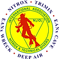

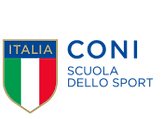

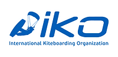

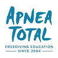

Luca

**Skipper, moniteur de kitesurf et d'apnée Skipper, moniteur de kitesurf et d'apnée**

Luca est titulaire du diplôme **RYA Yachtmaster Offshore** et **moniteur** **de voile reconnu par le CONI.**  
Il est également **moniteur** **de plongée en apnée** pour **l'AIDA et Apnea Totale**, ainsi que **moniteur de kitesurf certifié IKO International.**

Sa passion pour l'hospitalité, combinée à son amour de la bonne cuisine, crée une **expérience à bord unique** axée sur **le bien-être physique et mental**, mêlant activités sportives à des pratiques telles que **la méditation et le Janzu**, le tout enrichi par les plaisirs d'une **Dolce Vita** saine.

Brano

**Dive Master, chasse sous-marine et esprit d'aventure**

Brano est un plongeur expert, avec des certifications allant de **Divemaster IANTD à Cave Diver et Rescue Diver**, en passant par la plongée avancée et l'apnée.

Sa passion pour la mer l'a conduit à explorer **plus de 30 pays**, en s'adonnant aux sports extrêmes, aux voyages d'aventure et à l'innovation technologique.

En **2022**, il a cofondé **Ikigai Sailing** avec Luca, créant un projet qui allie **aventure, durabilité et liberté**, inspirant les autres à vivre pleinement.

**Paola Matelot et assistante**

Je m’appelle Paola, j’ai 35 ans et je suis française. Je suis ici aujourd’hui parce que ma vie tourne autour de deux grandes passions : la cuisine et la mer.

La cuisine a toujours été ma façon d’exprimer ma créativité, mon attention et mon envie de partager. J’adore préparer des plats qui racontent des histoires, mélanger les saveurs et les traditions, et créer des moments de pur plaisir autour de la table.

À bord du catamaran Ikigai, j’ai trouvé l’endroit idéal pour unir cette passion à mon amour de la mer, aux rencontres enrichissantes et à une vie en mouvement constant. C’est un environnement essentiel et dynamique qui m’inspire chaque jour, laissant place à une cuisine vivante, simple et sincère qui enrichit naturellement le voyage.

L'HISTOIRE

[Lire l'histoire](https://www.ikigaisailing.com/en/the-story/)

Ikigai Sailing

Ikigai Sailing n’est pas seulement un voilier : **c’est une vision, un mode de vie**.  
C’est un **retour à la nature, la découverte de nouveaux horizons et l’adoption d’activités qui nourrissent à la fois le corps et l’esprit**.

C'est le **plaisir de partager des moments authentiques**, **de** pratiquer des sports, d'explorer différentes cultures et **de vivre chaque jour comme une pause loin du monde moderne trépidant**.  
En d'autres termes, **c'est une évasion hors de la Matrix**.

Notre projet est un **voyage à la voile autour du monde**, où nous enseignons et partageons nos passions, en promouvant un **mode de vie sain et durable**. Nous vivons de tout, des **traversées océaniques aux semaines de navigation relaxantes**, en cultivant des intérêts au-delà de la voile : **de la gastronomie au bien-être, du sport à la méditation**.

[Découvre ton Ikigai avec nous](https://www.ikigaisailing.com/en/ikigai-2/)

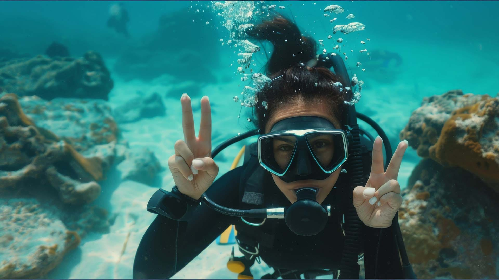

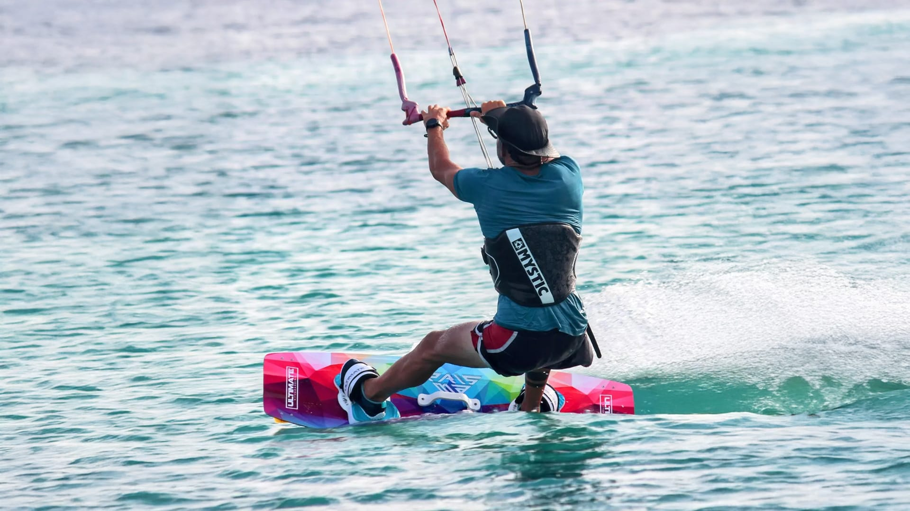

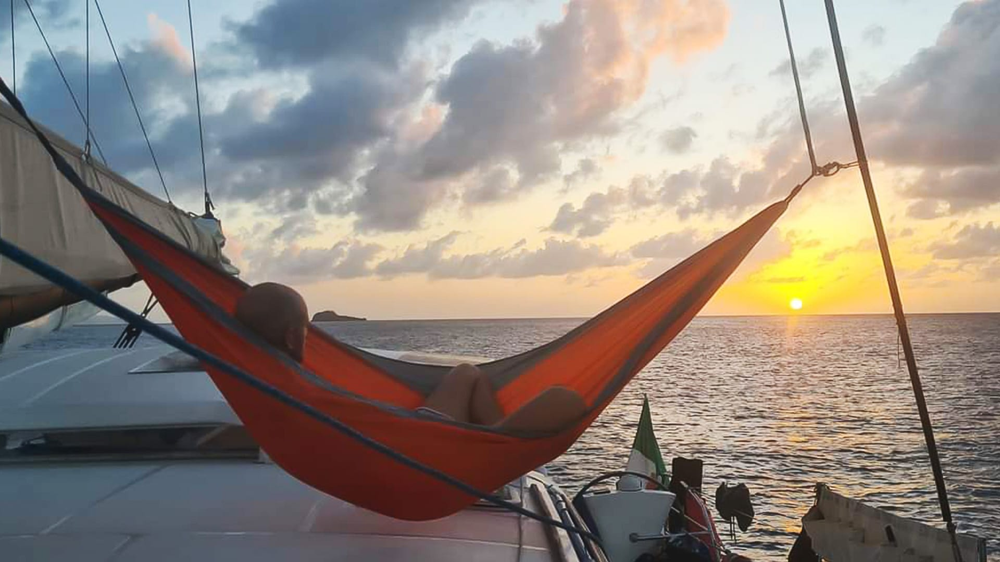

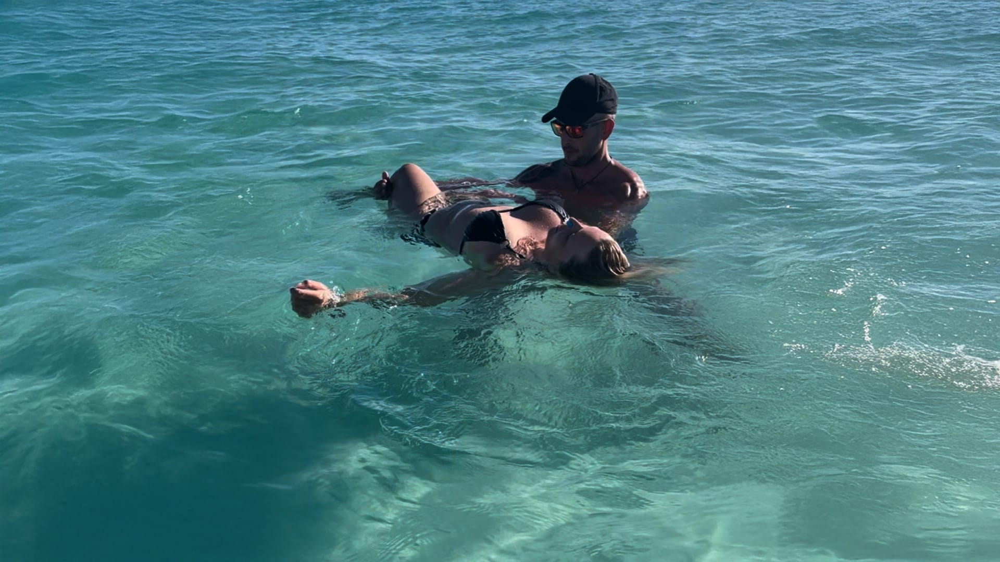

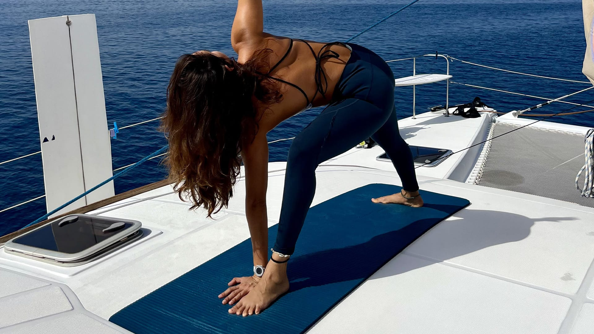

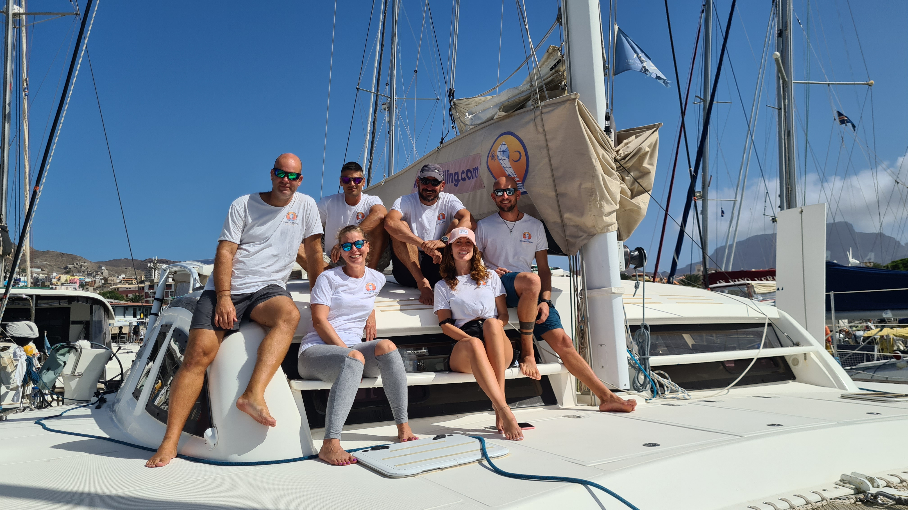

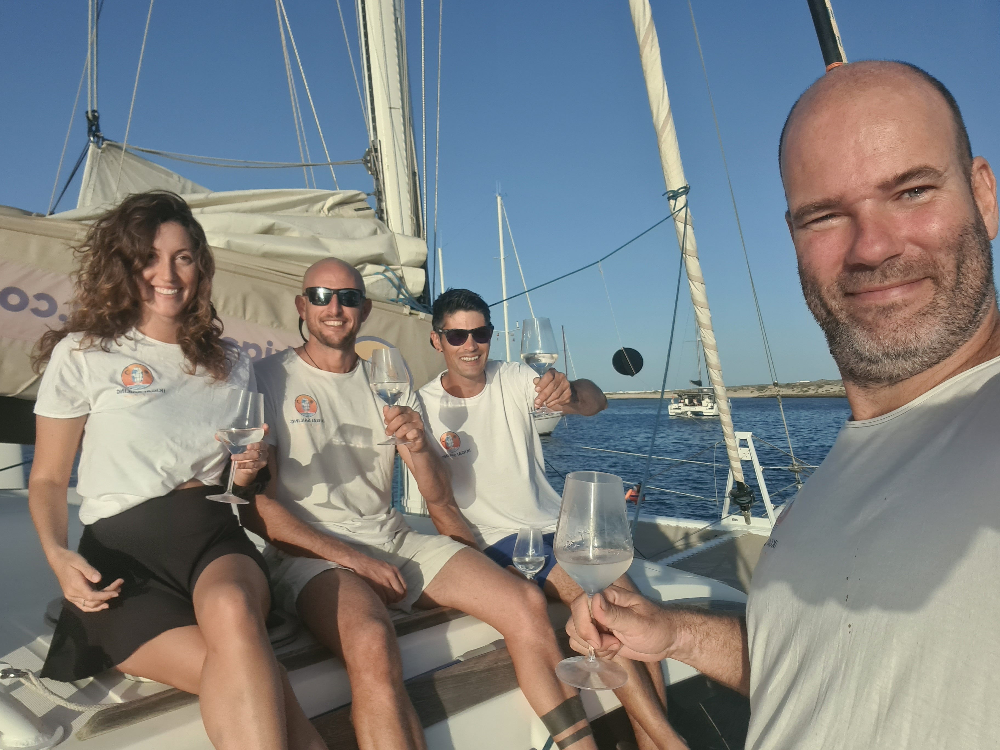
