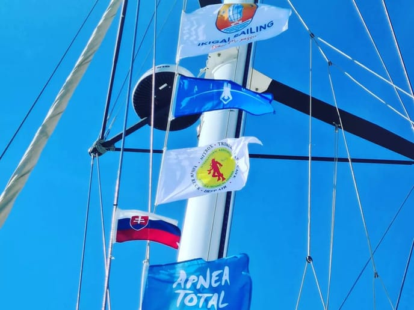
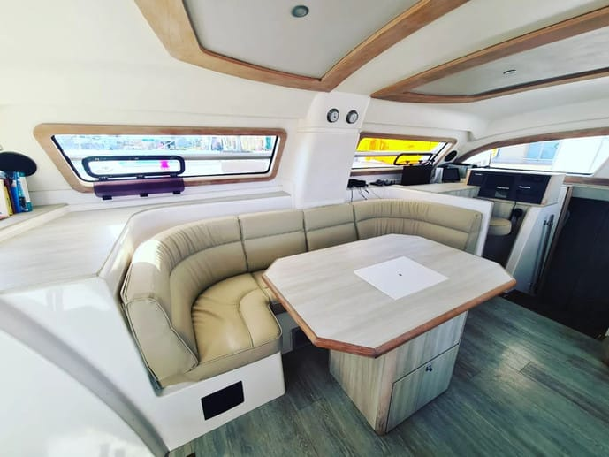
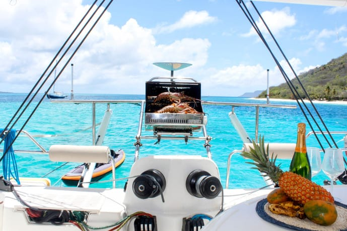
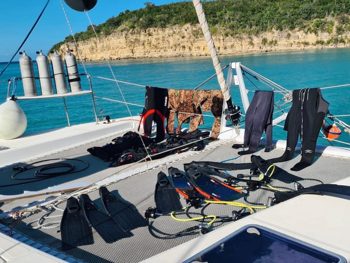
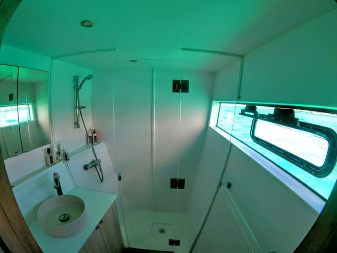
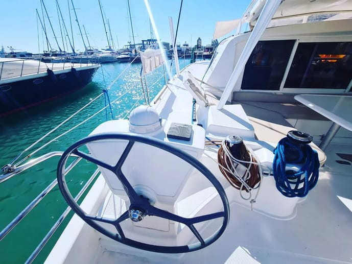
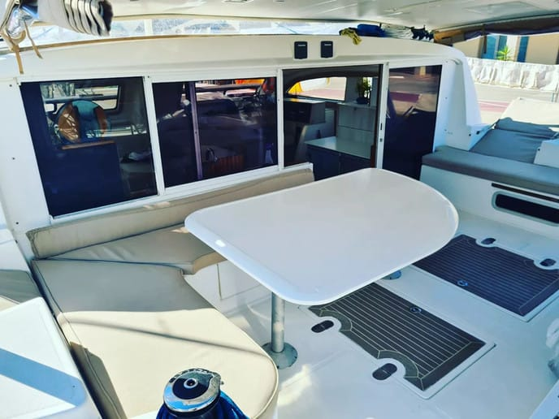
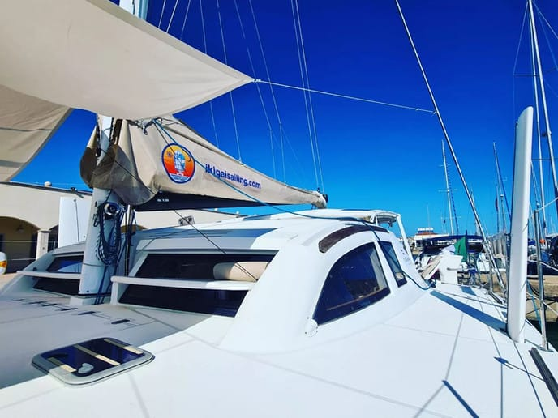
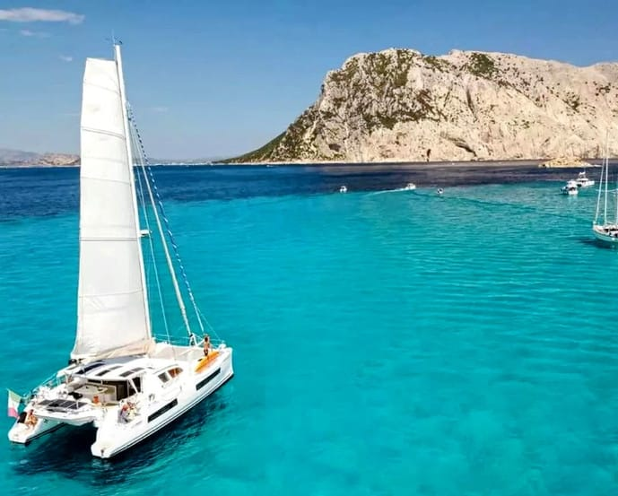

## CATANA 47

CATANA 47

Il Catana 47 è una barca concepita per godere delle comodità e degli spazi senza rinunciare alle emozioni della vela e del mare. E’ un catamarano dalle alte performance, in grado di mantenere velocità elevate durante le lunghe traversate e di muoversi agevolmente anche con poco vento mentre gli interni spaziosi garantiscono comfort in ogni condizione meteo. Può accogliere dalle 6 alle 7 persone in 4 cabine.

[Virtual tour](https://www.catana.com/visite/Catana-47/Catana-47.html)

Il Catana 47 è una barca concepita per godere delle comodità e degli spazi senza rinunciare alle emozioni della vela e del mare.E’ un catamarano dalle alte performance, in grado di mantenere velocità elevate durante le lunghe traversate e di muoversi agevolmente anche con poco vento mentre gli interni spaziosi garantiscono comfort in ogni condizione meteo.

La barca dispone di **2 cabine doppie** (configurabili con 2 letti singoli od 1 grande letto matrimoniale) ed **1 cabina con un letto matrimoniale**. La quarta cabina e’ stata trasformata in un **grande bagno con doccia panoramica per due persone** mentre i wc (elettrici) sono 2, uno su ogni scafo.

A prua si trova la cabina dell’equipaggio, il cala vele ed un intera cabina adibita allo stoccaggio di attrezzature sportive mentre a poppa in grande tavolo del pozzetto puo essere abbassato per creare un altro grande letto matrimoniale.

## IN CUCINA:

In cucina essendo amanti del buon cibo ed ex ristoratori di professione, questo ambiente ricopre un ruolo centrale a bordo ed e’ cosi allestito:

Bread Maker: sfornare il proprio pane giornalmente non ha prezzo

### Barbecue Magma XL: protagonista di mille grigliate specialmente dopo una battuta di pesca fortunata

### Cucina 4 fuochi, forno a gas Inox, frigorifero, freezer, lavastoviglie, macchina per la pasta fresca, blender etc etc.

### Macchina del caffe automatica con macinino integrato

### Impianto di acqua potabile capace di erogare acqua frizzante/naturale fredda o temperatura ambiente.

## AUTONOMIA:

Sotto il profilo energetico siamo completamente autonomi disponendo di 12 pannelli solari, idroturbina, 600 amper di batterie al litio ed un generatore diesel da 5kw.

Disponiamo inoltre di 2 watermaker per un totale di 150 LT/H e di 1 lavatrice.

## ATTREZZATURA SPORTIVA:

A bordo troverete anche :

  * Dinghy 25hp,
  * Kayak 3 posti
  * SUP
  * Attrezzatura da snorkeling, freediving e spearfishing
  * Attrezzatura completa per scuba diving
  * Attrezzatura per kitesurfing
  * Mat Yoga

[!](https://www.ikigaisailing.com/wp-content/uploads/2025/01/d7f8a8_7c038b30775c4f34b61113a3180a796bmv2.jpg)

[!](https://www.ikigaisailing.com/wp-content/uploads/2025/01/d7f8a8_8e548b8301844ce39be1761967b738c4mv2.jpg)

[!](https://www.ikigaisailing.com/wp-content/uploads/2025/01/d7f8a8_8e548b8301844ce39be1761967b738c4mv2.jpg)

[!](https://www.ikigaisailing.com/wp-content/uploads/2025/01/20221213_090006-scaled.jpg)

[!](https://www.ikigaisailing.com/wp-content/uploads/2025/01/d7f8a8_1ef33af2ebbc4e95ad5fe1d48c6edafdmv2.jpg)

[!](https://www.ikigaisailing.com/wp-content/uploads/2025/06/7DCEF313-82F8-4B99-A9CE-0A0AF7792C05_1_201_a-scaled.avif)

[!](https://www.ikigaisailing.com/wp-content/uploads/2025/06/9d81ff7c-0f84-48ed-b44a-efc36ece6d56-scaled.avif)

[!](https://www.ikigaisailing.com/wp-content/uploads/2025/06/77153A04-394A-4BF7-ABE8-562BB9D30533_1_201_a-scaled.avif)

[!](https://www.ikigaisailing.com/wp-content/uploads/2025/06/IMG_20250523_170428_304-scaled.avif)

[!](https://www.ikigaisailing.com/wp-content/uploads/2025/06/FA81EF04-3D2F-40C0-AE13-8A9A15863DD1_1_201_a-scaled.avif)

ALLESTIMENTO

## VELE

Vele (nuove nel 2017):

Randa 86m2 in tessuto Hydranet 483/433 con 5

stecche, 3 terzaroli e segnaposto

Carrelli con cuscinetti a sfera Harken T32

Lazy bag (nuova 2021)

Genova su strallo principale 53m2 taglio triradiale in tessuti idranet 433, striscia anti UV

Gennaker su avvolgitore di bompresso di 130 m2 in tessuti di nylon, cavo anti-torsione, tessuto blu stormlite con striscia anti-UV

Code 0 di 81 m2 si avvolgitore per bompresso in tessuti laminati carbonio aramidico, cavo antitorsione, fascia in tessuto anti UV CZ60/30

Secondo gioco di vele in dacron, randa e genoa.

## ELETTRONICA

Elettronica Raymarine (nuova nel 2017):

Cartografico Axiom 9 (2020)

Multi I70

VHF RA60

2 X wind display I60,

1 X multi I70

1 console di pilotaggio X P70,

Pilota principale Raymarine ACU 400 con cilindro idraulico (L&S),

Pilota di emergenza Raymarine con cilindro idraulico (L&S)

Radar Quantum

Ricetrasmettitore AIS 650 Classe B

## VARIE

Dissalatore 12V Aquabase 105L/h ESW901

Idrogenatore marino watt&sea 600W

Parco batterie al litio Victron (2021)

Daggerboard in carbonio (2017)

Pannelli solari (8 X 110W) (2017)

Impianto riscaldamento webasto (2021)

Frigorifero Liebherr A++ 220V su inverter dedicato (2021)

Congelatore Lieberr A++ 220V su inverter dedicato (2021)

Lavastoviglie (2021)

Lavatrice Candy 3kg (2017)

