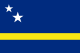

## Ikigai Sailing | Stagione 2025/26 SAN BLAS

Vivi l’esperienza Ikigai in mare aperto: avventura, libertà e crescita personale tra le meraviglie dei Caraibi.

[Scopri di più e prenota ora](https://www.ikigaisailing.com/stagione-2025-26/)

## Vivi il mare come casa   
Un mese per ritrovarti

## Vivi il mare come casa   
Un mese per ritrovarti

**Contributo: 2.000€ per un mese di vita a bordo**   
 _Inizia con una settimana di prova a 1.000€_

[Scopri di più e prenota ora](https://www.ikigaisailing.com/it/stagione-2025-26-2/)

## PASSIONE

Per il mare, la vela, l’avventura, i viaggi, la cucina, gli sport

[scopri di più](https://www.ikigaisailing.com/ikigai/)

## MISSIONE

Promuoviamo un turismo sostenibile ed uno stile di vita sano grazie al quale nutrire a pieno i semplici bisogni primari capaci di produrre il vero Ben-Essere 

[scopri di più](https://www.ikigaisailing.com/ikigai/)

## VOCAZIONE

Avvicinare le persone alle loro passioni, ad altre persone, alla natura ed a sè stesse. 

[scopri di più](https://www.ikigaisailing.com/ikigai/)

## PROFESSIONE

Svolgiamo corsi formativi e stage delle attività che amiamo e che pratichiamo quali la vela, l’apnea, la pesca, il diving, il kitesurf e lo yoga.

[scopri di più](https://www.ikigaisailing.com/ikigai/)

## ABOUT US

Ikigai Sailing è un’associazione sportiva dilettantistica senza scopo di lucro, riconosciuta dal **CONI** e affiliata all’ente di promozione sportiva **MSP Italia.**  
Una comunità in crescita di sognatori, velisti, apneisti, subacquei, kitesurfer e appassionati di avventura e sport. 

[Discover more](https://www.ikigaisailing.com/about-us/)

SAILING AROUND

THE WORLD

**Ikigai Sailing** è un’associazione sportiva dilettantistica no-profit riconosciuta dal CONI e affiliata MSP Italia. Una community in crescita di sognatori, velisti, apneisti, sub, kiter e amanti dell’avventura.

Siamo partiti dal Mediterraneo nell’estate 2022, attraversando l’Atlantico fino ai Caraibi, navigando tra Antille, Los Roques e Antille Olandesi.

La nostra rotta ci porterà ora in Colombia, attraverso il Canale di Panama, verso il Pacifico: Galápagos, Polinesia Francese, Fiji, Indonesia, Asia e infine ritorno nel Mediterraneo.  
**Unisciti a bordo per scoprire il mondo a vela, da una prospettiva unica.**

[ CHI SIAMO ](https://www.ikigaisailing.com/about/)

dal

2022

in giro per gli oceani

20

+

Paesi Visitati

10.000

+

Miglia percorse

## Siamo orgogliosi di aver raggiunto queste mete

Saint Kitts and Nevis

Bonaire

Curaçao

Aruba

Anguilla

British Virgin Islands

Guadeloupe

Martinique

Gibraltar

Canary Island

Capo Verde

Flag_of_Sint_Maarten.svg

Flag_of_Antigua_and_Barbuda.svg

Domica

Grenada

Flag_of_Saint_Vincent_and_the_Grenadines.svg

Venezuela

Los Roques

Panama

Venezuela

ATTIVITÀ A BORDO

Alterniamo lunghe navigazioni in luoghi inesplorati a periodi di maggiore stabilità quando scopriamo posti che si allineano perfettamente con la nostra filosofia e le attività che pratichiamo

## [E molto altro ancora... Scopri tutte le attività qui](https://www.ikigaisailing.com/sport-attivita/)

### FORMULE DI IMBARCO

Salpa verso l’avventura con Ikigai Sailing!

Scopri il piacere della libertà, della scoperta e del benessere in mare con esperienze uniche pensate per ogni spirito avventuroso. Da settimane di pura evasione a ritiri trasformativi, c’è un viaggio perfetto per te.

[Aggiungi al carrello](/it/home/?add-to-cart=95645)

#### [Ikigai experience](https://www.ikigaisailing.com/it/prodotto/ikigai-experience/ "Ikigai experience")

[Leggi tutto](https://www.ikigaisailing.com/it/prodotto/imbarco-a-scambio/)

#### [Imbarco a Scambio / Retribuito](https://www.ikigaisailing.com/it/prodotto/imbarco-a-scambio/ "Imbarco a Scambio / Retribuito")

[Aggiungi al carrello](/it/home/?add-to-cart=40826)

#### [10 Days experience](https://www.ikigaisailing.com/it/prodotto/vivere-10-giorni-a-bordo/ "10 Days experience")

[Esperienza riservata ai soci!](https://www.ikigaisailing.com/it/prodotto/traversata-pacifica/)

[Aggiungi al carrello](/it/home/?add-to-cart=38746)

#### [Traversata Oceano Pacifico](https://www.ikigaisailing.com/it/prodotto/traversata-pacifica/ "Traversata Oceano Pacifico")

[Esperienza riservata ai soci](https://www.ikigaisailing.com/it/prodotto/un-mese/)

[Aggiungi al carrello](/it/home/?add-to-cart=38744)

#### [Un Mese a Bordo](https://www.ikigaisailing.com/it/prodotto/un-mese/ "Un Mese a Bordo")

## LA ROTTA

Scopri dove ci troviamo ora

Nel 2025/26 il nostro viaggio ci vede presso le incantevoli Isole San Blas, un paradiso unico nei Caraibi. La traversata del Pacifico è prevista per il 2027, aprendo un nuovo capitolo di avventure.

  * San Blas

[ Scopri la rotta ](https://www.ikigaisailing.com/itinerario/)
