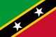
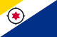
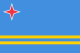

## TRASA

Poloha v reálnom čase

Zistite, kde sa práve nachádzame, a sledujte všetky naše pohyby.

Trasa

Tu je zoznam miest, ktoré Ikigai Sailing navštívila počas svojej cesty okolo sveta, s krátkym popisom každého z nich:

2022

!

### Vyplávame!

-   **Júl – Rím, Taliansko** Východiskový bod cesty s emotívnym rozlúčením s talianskym hlavným mestom, ktoré je bohaté na históriu a kultúru.
-   **August – Sardínia, Taliansko** Drsné pobrežie ostrova a krištáľovo čistá voda poskytli dychberúcu scenériu a hladkú plavbu.
-   **September – Baleárske ostrovy, Španielsko** Objavovanie ostrovov známych nedotknutými plážami, skrytými zátokami a pulzujúcou energiou, najmä Mallorky a Ibizy.
-   **Október – Almerimar, Španielsko** Technická zastávka venovaná príprave a údržbe lode na výzvy Atlantiku.
-   **November – Gibraltár** „Brána do Atlantiku“, kde sa posádka pripravovala na preplavbu na Kanárske ostrovy.
-   **December – Kapverdy (15.–18. december)** Krátka, ale intenzívna zastávka na tropických ostrovoch, bohatých na kreolskú kultúru a sopečné krajiny.

2023

!

### Prechod cez Atlantik

**Január**

-   ```
    * **Saint Martin** A Caribbean island, half French and half Dutch, known for its stunning beaches and European-Caribbean cultural blend.
    ```
    
    -   **Panenské ostrovy** Rozprávkové súostrovie s pokojnými zátokami, ideálne na plachtenie a potápanie.
    -   **Barbuda** Ružové pieskové pláže a nedotknutá príroda sú skutočným tropickým rajom.
    -   **Antigua** Známy svojimi 365 slnečnými dňami a rovnakým počtom pláží, miesto s bohatou námornou históriou.

**Február**

-   ```
    * **Guadeloupe** A butterfly-shaped island known for its biodiversity and crystal-clear waters ideal for snorkeling.
    ```
    
    -   **Dominika** „Prírodný ostrov Karibiku“ s bujnými dažďovými pralesmi, úchvatnými vodopádmi a pohostinnou kultúrou.
    -   **Martinik** Dokonalá fúzia francúzskych a karibských vplyvov s vulkanickou krajinou a plážami s čiernym pieskom.

**Marec**

-   ```
    * **Grenada** The “Spice Island,” is famous for its nutmeg plantations and golden beaches.
    ```
    
    -   **Svätý Vincent** Hornatý, bujný ostrov s autentickým a divokým šarmom.
    -   **Bequia** Malebný ostrov známy ručnou výrobou lodí a pokojnými vodami.
    -   **Mustique** Exkluzívne útočisko celebrít s rozprávkovými plážami a luxusnou atmosférou.
    -   **Martinik** Návrat na ostrov za ďalším objavovaním a relaxom.
    -   **Canouan** Malý ostrov známy luxusnými rezortmi a úchvatnými výhľadmi.
    -   **Tobago Cays** Morský raj neobývaných ostrovov a koralových útesov.
    -   **Petit Saint Vincent** Exkluzívny útočisko s bujnou prírodou a opustenými plážami.
    -   **Union Island** Živý a očarujúci ostrov, milovaný pre svoju príjemnú atmosféru a miestne trhy.
    -   **Mayreau** Malý ostrov s intímnou atmosférou, ideálny na pokojný oddych.
    -   **Martinik** Ďalšia zastávka na ostrove na oddych a doplnenie zásob.
    -   **Dominika** Opätovná návšteva s cieľom ďalej preskúmať bujnú prírodu ostrova.

**Jún**

-   ```
    * **Grenada** Another visit to further enjoy the local hospitality and natural beauty.
    ```
    

**September – Martinik** Dlhšia zastávka, aby sme si užili príjemné podnebie a pohodlie ostrova.

2024

!

### Venezuela a ostrovy

**Január** – Anguilla, Guadeloupe

**Február** – Dominika

**Marec** – Venezuela, Los Roques

**Jún** – Curaçao, Los Roques

**December** – Los Roques

2025

!

### ABC a Panama

\*\*25  
. marec Aruba, Bon Air,  
Curacao\*\*Ďalej sa vydáme do Kolumbie, potom prejdeme Panamským prieplavom a dostaneme sa do Tichého oceánu...

2026

!

### San Blas

ĎALEJ

!

### Preplávanie Tichého oceánu

Naše dobrodružstvo nás zavedie na **Galapágy, Markézy, Tahiti a Fidži,** až nakoniec dorazíme do severnej **Austrálie**. Potom poplávame do **Indonézie, Thajska, Srí Lanky a na Maldivy**, než prekročíme Indický oceán smerom k **Indii a Dubaju**.

Odtiaľ budeme sledovať pobrežie **Ománu a Jemenu** do **Červeného mora**, prejdeme cez Sudán a Egypt, a potom cez **Suezský prieplav** opäť vstúpime do **Stredozemného** mora, čím naše dobrodružstvo skončí.

## Sme hrdí, že sme dosiahli tieto ciele

Svätý Krištof a Nevis

Bonaire

Curaçao

Aruba

Anguilla

Britské Panenské ostrovy

Guadeloupe

Martinik

Gibraltár

Kanárske ostrovy

Kapverdy

Vlajka\_Sint\_Maarten.svg

Vlajka\_Antiguy\_a\_Barbudy.svg

Domica

Grenada

Vlajka\_Svätého\_Vincenta\_a\_Grenadín.svg

Venezuela

Los Roques

Panama

Venezuela

GOOGLE EARTH TRASA
