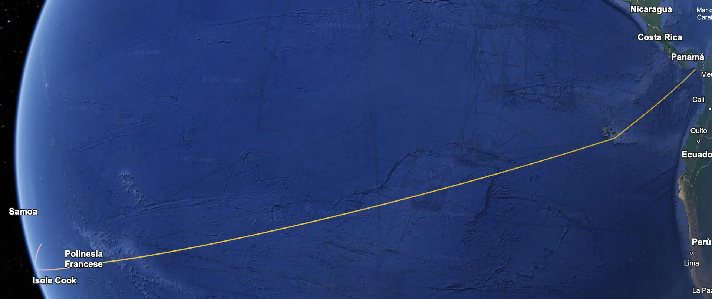

2.000,00 €

**¡Acompáñanos en una aventura única en la vida a través del océano Pacífico!**

-   Precio e inclusiones

## Descripción

\*\*La Gran Travesía del Pacífico_: de Panamá a las Islas Marquesas – Marzo de 2027_ \_ \_ Una experiencia única, intensa e irrepetible. Embarcarse en una travesía oceánica es algo que va más allá de la navegación. Es un salto hacia lo desconocido, un acto de confianza. Es reconectar con el ritmo del viento, la noche y tu mundo interior.

En marzo de 2027, _el Ikigai_ zarpará desde las costas de Panamá para cruzar el océano Pacífico. Un viaje épico de más de 30 días de navegación, a través de una de las zonas más remotas y vírgenes del planeta.

\*\*El itinerario **Salida**: finales de febrero de 2027 – Archipiélago de Guna Yala (Panamá) Tras pasar meses en las islas de San Blas, zarparemos hacia el suroeste. Las primeras 1.000 millas nos llevarán a las Galápagos, a las que llegaremos tras unos 10 días en mar abierto. Serán días de viento, olas, luz de luna y silencio. Días de transformación.

Una breve parada entre las islas volcánicas para tocar tierra, reabastecernos y prepararnos para el gran salto: La travesía de 3.000 millas hasta las Islas Marquesas, en el corazón de la Polinesia Francesa. Unos 20 días de navegación sin parar, donde el océano se convierte en hogar, horizonte y maestro.

\*\*Esto no son unas vacaciones. Es una experiencia de vida. Quienes se unan a esta travesía formarán parte de la tripulación. Compartirán turnos, maniobras, cocina, navegación, silencios y amaneceres. Y formarán parte de algo excepcional: una comunidad que navega hacia lo desconocido con el corazón abierto.

No necesitas conocimientos avanzados de navegación, solo capacidad de adaptación, saber escuchar y ganas de transformarte.

\*\*¿Por qué hacerlo? Para sentir de verdad lo que significa el tiempo, cuando ya no lo rigen las notificaciones, sino las olas. Para contemplar el cielo nocturno sin luz artificial y encontrar tu verdadero rumbo. Para formar parte de algo más grande, algo real. Para vivir la esencia del océano... y descubrir la tuya propia.

\*\*¿Quieres cruzar el Pacífico con nosotros? [Rellena el formulario para mantenerte al día](/es/contacto/) y recibir todos los detalles técnicos, económicos y logísticos a medida que se acerque la salida. Las plazas serán muy limitadas. La selección tendrá lugar en 2026. Pero la intención empieza ahora.

**«Quienes han visto el mar abierto nunca vuelven a ser los mismos».**

## Contribución e inclusiones

**Incluido / No incluido QUÉ INCLUYE**

-   Patrón certificado RYA Yacht Master con experiencia en alta mar
-   Alojamiento durante todo el periodo en un camarote doble compartido a bordo _del Ikigai_, un Catana 47 (14 m), un catamarán de expedición oceánica diseñado para la navegación de largo recorrido, equipado con:
-   Instrumentación electrónica doble
-   Sistema de energía autónomo (paneles solares, generador, hidrogenerador, inversor)
-   Dos puestos de mando y sistemas de seguridad
-   Desalinizador para la producción de agua dulce
-   Velas de repuesto y equipo de recambio completo
-   Embarcación auxiliar con motor fueraborda para desembarcos y traslados a tierra
-   Uso del equipo a bordo (kayak, SUP, equipo de snorkel, etc.) antes y después de la travesía
-   Participación gratuita en clases de yoga a bordo y en tierra
-   Descuentos en cursos de buceo libre y kitesurf (antes y después de la travesía)
-   Internet de alta velocidad a través de Starlink (sujeto a disponibilidad de cobertura)
-   Tarjeta de socio de Ikigai Sailing ASD válida para el año en curso
-   Equipo de seguridad actualizado (balsa salvavidas, chalecos salvavidas, bengalas, extintores, botiquín)
-   Piezas de repuesto básicas para el mantenimiento rutinario durante la navegación
-   Equipo de pesca
-   Sesión informativa inicial de seguridad y formación sobre la vida a bordo y la travesía
-   Ayuda práctica con los trámites aduaneros y logísticos en los puertos de escala

**QUÉ NO INCLUYE**

-   Vuelos y traslados
-   Fondo común a bordo (_cassa di bordo_)
-   Seguro de viaje (muy recomendable)
-   Comidas y bebidas consumidas en tierra
-   Cualquier cosa que no se mencione en «Qué está incluido»

**FONDO COMÚN A BORDO (gasto extra a tener en cuenta)**

-   Provisiones (compra inicial y cualquier reposición)
-   Gasóleo y gasolina
-   Tasas de despacho para la salida de Panamá y la entrada en la Polinesia Francesa (u otras islas intermedias)
-   Tránsito por el Canal de Panamá (peaje, personal de amarre, alquiler de cabos y defensas, posibles comisiones de agencia)
-   Tasas de fondeo o parques marinos (Galápagos, Gambier, Tuamotu, etc.)
-   Posibles tasas de atraque en puertos deportivos
-   Suscripciones de comunicación/meteorología: Iridium GO! / Starlink Ocean, PredictWind, créditos para teléfono satelital
-   Tarjetas SIM locales en los puertos intermedios
-   Visados y permisos para cada miembro de la tripulación
-   Posibles gastos de repatriación o vuelos en caso de desembarque anticipado
-   Traslados a tierra para aprovisionamiento o trámites administrativos

Agua potable extra (bidones/recargas en caso de problemas con el potabilizador)
