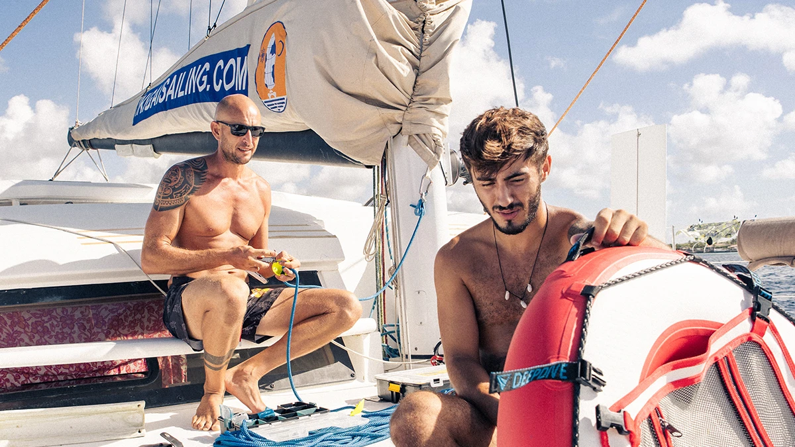

# Échange / Hébergement payant

Ikigai Sailing, c'est un projet de vie, un tour du monde par étapes qui mêle navigation, exploration, développement personnel et immersion dans la nature.

-   Description
-   Logistique

## Description

# **Rejoins l'équipage d'Ikigai**

À bord _d'Ikigai_, un catamaran de performance Catana 47 de 14 mètres, on ne se contente pas de proposer des expériences uniques de voile, de plongée en apnée, de kitesurf et de vie en mer : on construit une communauté.

Si tu te sens attiré par l'océan et que tu veux te lancer un défi, il y a deux façons de rejoindre notre équipage :

## **Bénévoles**

Tu veux apprendre, t'épanouir et acquérir une expérience pratique à bord ?

Nous recherchons des personnes motivées qui souhaitent découvrir le monde de la voile et les disciplines que nous pratiquons : voile, plongée en apnée, kitesurf, apnée et gestion de la vie à bord.

-   Tu consacreras environ 2 à 3 heures par jour à des activités de soutien (gestion du bateau, petites tâches, aide à l'équipage).
-   En contrepartie, tu bénéficieras de l'hébergement gratuit et auras l'occasion de vivre la mer en tant que véritable acteur.
-   Tu partageras les dépenses communes avec nous tous en contribuant à la caisse de bord (_cassa di bordo_).

**Échange de compétences**

Nous accueillons également des bénévoles qui souhaitent apporter leurs compétences professionnelles plutôt que de participer aux tâches pratiques quotidiennes.

Si tu es vidéaste, conteur, blogueur de voyage, photographe ou créateur de contenu, tu peux proposer une collaboration basée sur l'échange : l'hébergement en échange de tes services.

C'est l'occasion idéale si tu as peu d'expérience en mer et que tu souhaites apprendre sur le terrain, ou si tu veux mettre ton talent créatif à profit tout en vivant et en racontant une aventure unique.

## **Professionnels**

Si tu as déjà de l'expérience dans le secteur nautique et que tu souhaites apporter ta contribution de manière plus spécifique, nous recherchons des hôtesses et des matelots ayant des compétences en gestion et en entretien de bateaux.

-   Tu peux postuler en tant que membre d'équipage expérimenté.
-   Nous offrons un environnement dynamique et stimulant, où tes compétences seront valorisées et mises au service du projet.

## **Pourquoi postuler ?**

-   Pour vivre la mer comme un chez-soi, et pas seulement comme de simples vacances.
-   Pour faire partie d'un projet qui allie sport, nature et communauté.
-   Pour grandir en tant que personne et en tant que marin, en partageant des expériences et des responsabilités.
-   Pour contribuer, par ton travail ou tes compétences créatives, à un projet authentique et en constante évolution.

[**Envoie ta candidature**](https://www.ikigaisailing.com/contact-2/)

Dis-nous qui tu es, quelle est ton expérience et pourquoi tu souhaites rejoindre Ikigai. Que tu sois un bénévole en quête d'aventure, un créatif désireux de partager tes compétences ou un professionnel prêt à apporter un soutien concret, notre équipe t'attend.

## Logistique

Ton voyage commencera très probablement par ton arrivée à l'aéroport international de Tocumen (PTY) à Panama City, les vols à l'arrivée étant généralement prévus l'après-midi ou en soirée.

C'est pourquoi une nuitée d'au moins une nuit dans la capitale sera nécessaire. C'est l'occasion idéale d'explorer la ville et peut-être de flâner dans les charmantes rues de Casco Viejo, le quartier historique classé au patrimoine mondial de l'UNESCO.

🕔 Le lendemain, tôt le matin, une jeep 4×4 privée viendra te chercher directement à ton hôtel et t'emmènera vers la côte caraïbe.  
De là, après environ 2 h 30 de trajet à travers les forêts de Guna Yala, un bateau local t'emmènera à Ikigai, où tu arriveras vers 10 h 30.

À la fin de ton séjour, le jour du départ, tu suivras le même itinéraire en sens inverse : un bateau local viendra te chercher à l’aube directement à Ikigai et te ramènera sur le continent, où une jeep t’emmènera à l’aéroport à temps pour ton vol de retour.

✈️ L'ensemble du voyage est organisé par nos soins en collaboration avec des partenaires locaux de confiance, garantissant une expérience logistique fluide et sûre du début à la fin de ton séjour.

Si tu as des besoins spécifiques (comme des vols tôt le matin, des retards ou un séjour prolongé), n'hésite pas à nous en faire part afin que nous puissions trouver ensemble la solution la plus adaptée.
