[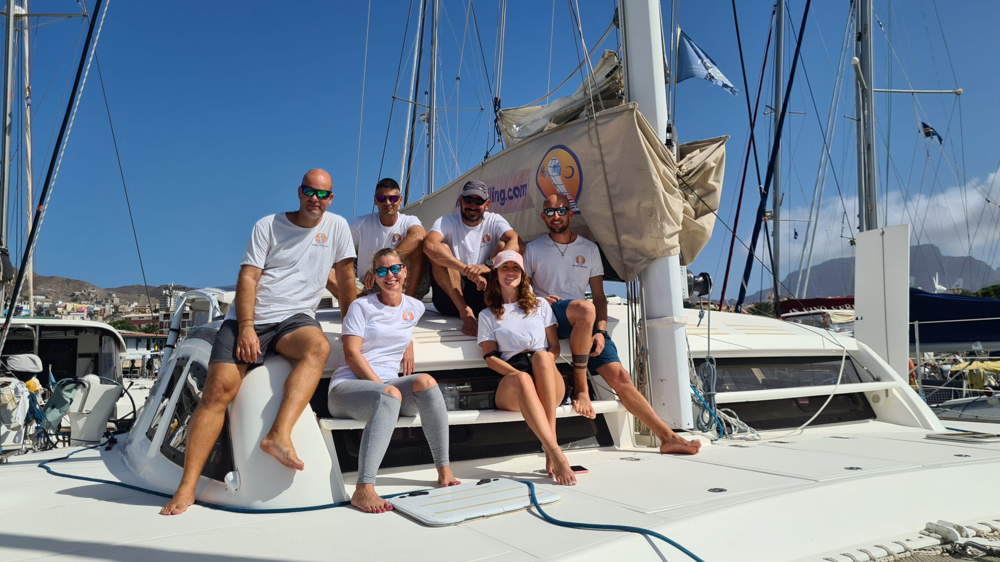](https://www.ikigaisailing.com/wp-content/uploads/2024/11/20221220_125124-scaled.jpg)

[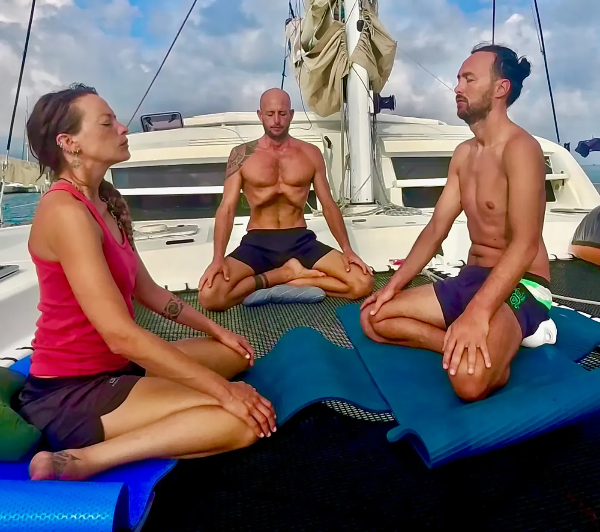](https://www.ikigaisailing.com/wp-content/uploads/2025/07/Fotogramma-21-07-2025-01-22-37.webp)

[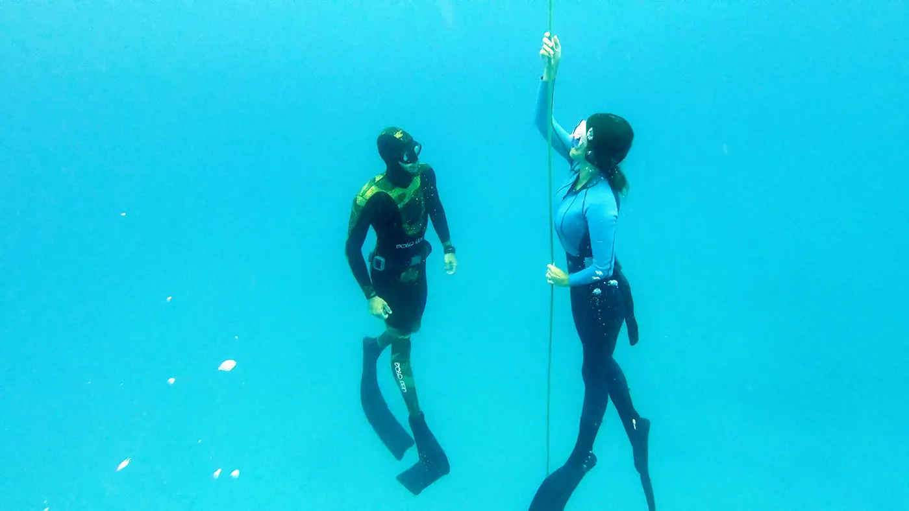](https://www.ikigaisailing.com/wp-content/uploads/2025/07/GH014735_1679677560764.webp)

[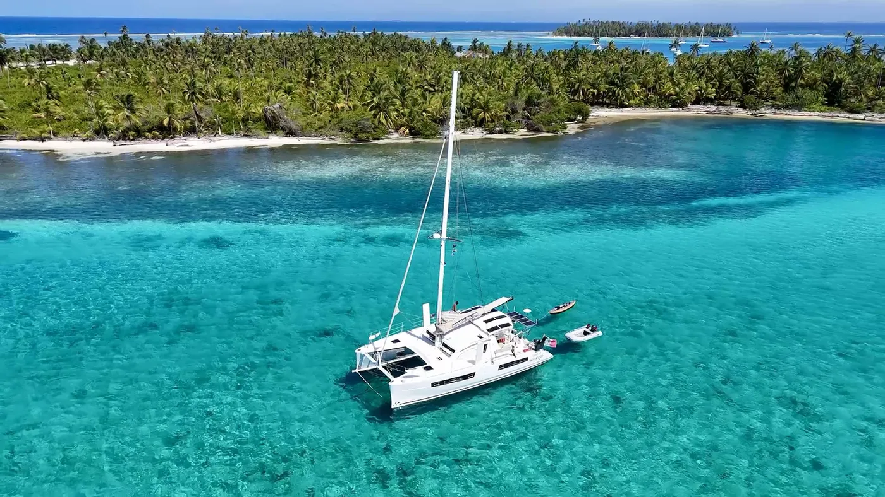](https://www.ikigaisailing.com/wp-content/uploads/2025/07/ikigai_1600x900_highquality.webp)

[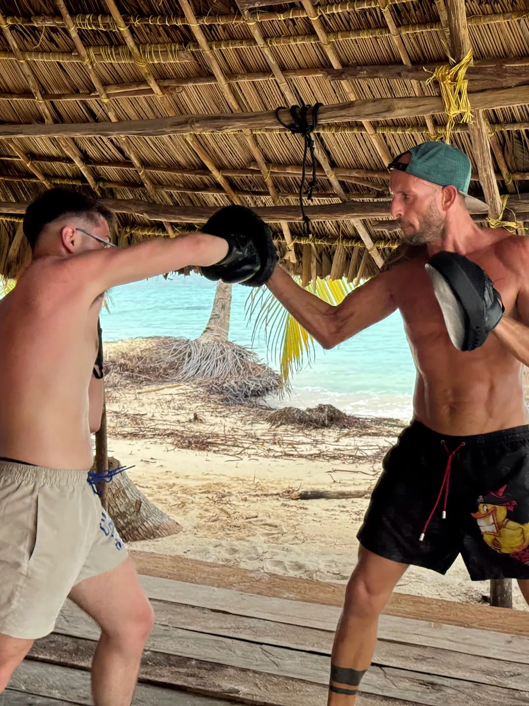](https://www.ikigaisailing.com/wp-content/uploads/2025/07/2f1afa20-5de7-48d6-a476-a3971f558173.webp)

[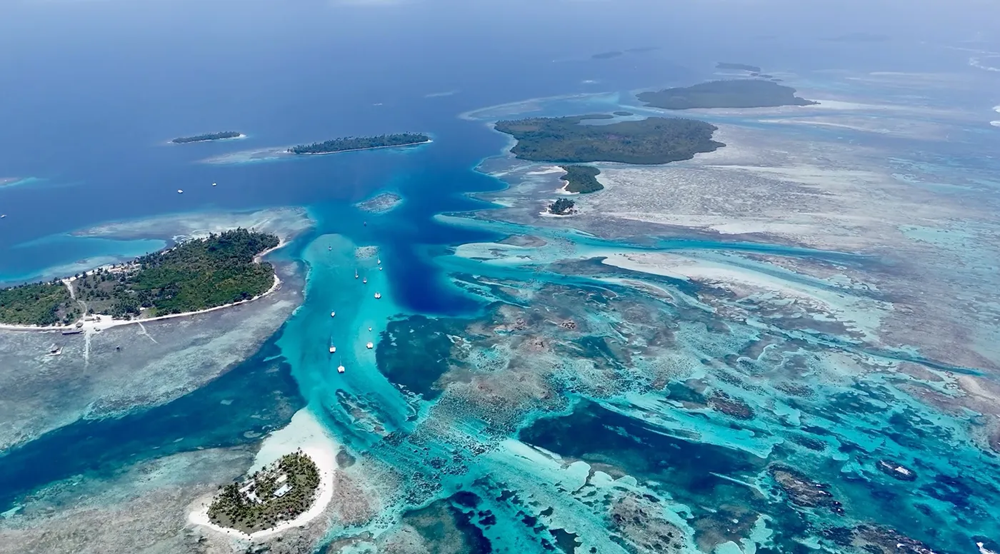](https://www.ikigaisailing.com/wp-content/uploads/2025/07/Screenshot-2025-06-12-alle-19.32.24.webp)

[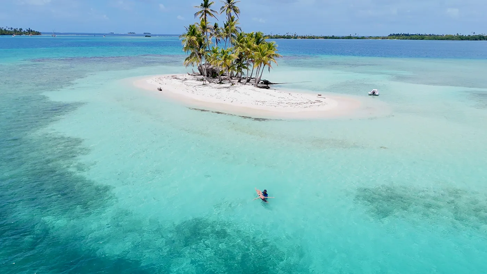](https://www.ikigaisailing.com/wp-content/uploads/2025/07/Snapshot-15-04-2025-16_13.webp)

[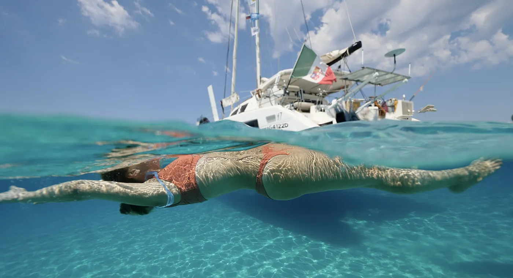](https://www.ikigaisailing.com/wp-content/uploads/2025/07/Snapshot-30-08-2024-08_12.webp)

[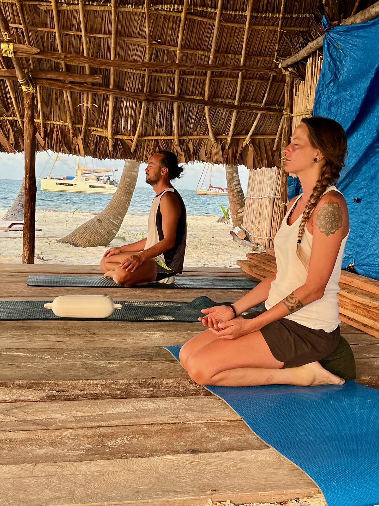](https://www.ikigaisailing.com/wp-content/uploads/2025/07/meditation-2.webp)

[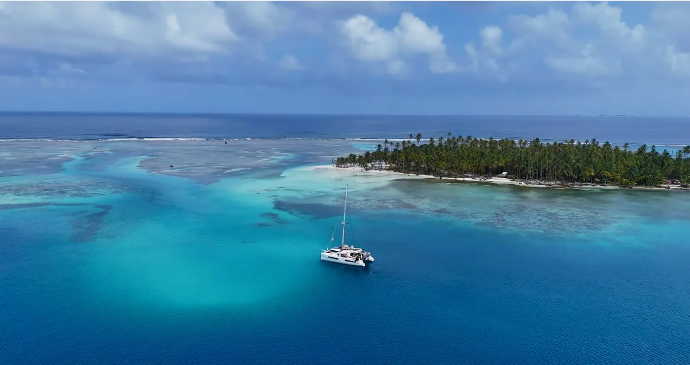](https://www.ikigaisailing.com/wp-content/uploads/2025/07/Untitled-design.webp)

[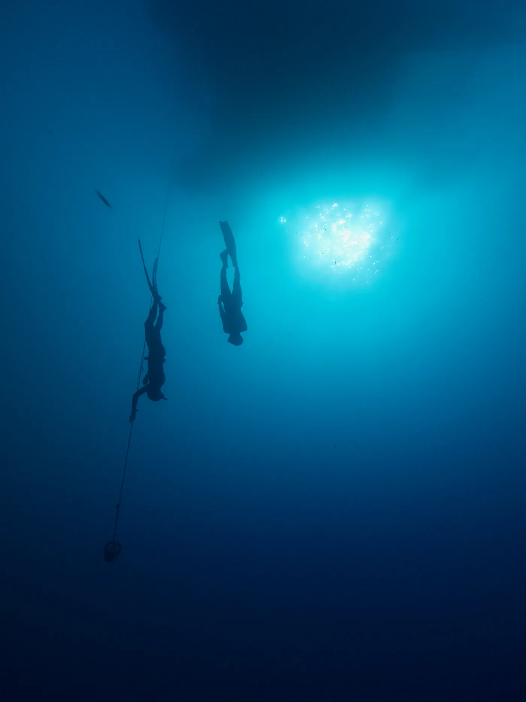](https://www.ikigaisailing.com/wp-content/uploads/2025/07/IMG_1280_Original.webp)

# 10 Days experience

3.000,00 €

Unita all’energia degli elementi, alla vita all’aria aperta e al potere curativo dell’acqua, questa esperienza è pensata per ristorare profondamente il tuo benessere fisico e mentale. Con la nostra formula all-inclusive ogni dettaglio è curato per permetterti un immersione completa

  * Descrizione 
  * Programma dettagliato 
  * *Contributo e Inclusioni 

## Descrizione

**UN CONCENTRATO DI VITA AUTENTICA, ESSENZIALE E RIGENERANTE**

In 10 giorni, ti guideremo attraverso pratiche trasformative e potenti. Questo ritiro è unico grazie ai nostri istruttori multidisciplinari, certificati da Yoga Alliance, AIDA International, Apnea Total e IKO International, che garantiscono **massima competenza e sicurezza** in ogni attività: dallo yoga al breathwork, dal freediving al kitesurfing. Il nostro skipper RYA Yacht Master ti condurrà sul nostro performante catamarano Catana 47, assicurando viaggi emozionanti e sicuri in questo paradiso acquatico.

Unita all’energia degli elementi, alla vita all’aria aperta e al potere curativo dell’acqua, questa esperienza è pensata per **ristorare profondamente il tuo benessere fisico e mentale**. Con la nostra formula all-inclusive e senza preoccupazioni, ogni dettaglio è curato per permetterti di immergerti completamente.

Qui, in un **paradiso incontaminato che sembra una dimensione parallela** , avrai la possibilità di vivere in armonia con la natura, lontano dal rumore della civiltà moderna. Un’opportunità rara per riconnetterti con ciò che è **essenziale, autentico e vivo**.

Vivremo immersi nella bellezza selvaggia dell’arcipelago di Guna Yala, dove mare, vento e sole diventano preziosi alleati in un profondo processo di riequilibrio interiore. Ogni notte sarai cullato dalle onde, ogni mattina ti sveglierai con il sole. Le nostre giornate seguiranno il **ritmo della natura** , un ritmo che ricalibra delicatamente il sistema nervoso, solleva l’umore, ristora il sonno profondo e risveglia la vitalità.

Ogni giorno sarà un **viaggio verso l’esterno e verso l’interno** , un ritorno a ciò che conta davvero. All’alba, inizieremo con meditazione, yoga e respirazione consapevole. Alleneremo corpo e mente in armonia con sessioni di freediving, nuoto sulla barriera corallina e movimento consapevole, sul ponte o sulle spiagge di un’isola remota. Scivoleremo silenziosamente su acque turchesi in kayak o stand-up paddleboard, esploreremo isolotti disabitati, veleggeremo tra ancoraggi nascosti e visiteremo le comunità Guna per scambi autentici, ascoltando storie antiche e testimoniando una cultura in profonda simbiosi con la natura. Potremmo incontrare delfini, squali nutrice e altre meraviglie selvagge che abitano queste acque cristalline, lasciando che la loro presenza ammorbidisca le nostre difese e risvegli il nostro senso di meraviglia.

Esplorerai il potere rigenerativo dell’acqua non solo con il freediving, ma anche con pratiche ispirate all’acqua radicate nel tocco terapeutico e nella presenza. Imparerai a respirare più profondamente, a placare la mente e ad ascoltare interiormente ogni volta che il tuo corpo scivola sotto la superficie.

I nostri pasti saranno **semplici e nutrienti** , preparati con cura e amore, usando ingredienti freschi e non processati. Nutriremo ciò che è reale, rilasciando delicatamente ciò che è stato imposto artificialmente. Ci sarà tempo per rallentare, ascoltarti veramente e riconnetterti con i tuoi sensi primordiali.

A bordo, coltiveremo relazioni fondate su **gentilezza, rispetto reciproco e ascolto profondo**. Insieme, creeremo uno spazio condiviso di presenza, autenticità e connessione significativa. E quando sarà il momento di tornare a terra, porterai con te più di semplici ricordi: avrai **l’impronta di una vita più semplice, più vivida e, forse, una bussola interiore più chiara** per guidare i tuoi prossimi passi.

Perché questa non è solo una fuga. È un **ritorno**.

## Programma dettagliato

# **10 Days Experience a bordo di Ikigai**

## **Premesse**

Ogni attività proposta è fortemente raccomandata, ma mai obbligatoria. L’invito è quello di uscire dalla tua zona di comfort, provando nuove esperienze e rafforzando la disciplina. Allo stesso tempo, ti incoraggiamo ad ascoltare profondamente il tuo corpo e i suoi bisogni.

Questa esperienza è pensata per farti sperimentare l’equilibrio tra impegno e ascolto, tra disciplina e libertà. Nessuna aspettativa, nessuna prestazione: solo la possibilità di ritrovarti nel ritmo naturale delle cose, nel contatto autentico con gli altri e con l’ambiente.

## **Routine quotidiana Mattino (circa 1h30):** Ogni giornata inizia con una sessione guidata che può includere tecniche di respirazione consapevole, sequenze di yoga dinamico o rilassante, meditazione seduta o in movimento, e – a rotazione – allenamenti a corpo libero in stile Tabata o elementi base del pugilato. Le sessioni variano in base al gruppo e alle condizioni climatiche.

**Sera:** In chiusura della giornata proponiamo una routine serale dedicata all’introspezione, al rilassamento e alla rigenerazione. Yoga al tramonto, meditazione, condivisione silenziosa o in cerchio, in base all’energia del gruppo e al luogo in cui ci troviamo.

**Tempo libero:** Gli intervalli tra le attività sono lasciati volutamente liberi per dare spazio al riposo, alla lettura, al bagno, al silenzio, o alla socialità spontanea. Non c’è nulla da fare, se non essere presenti a ciò che accade.

## **Vita a bordo & Cibo**

La cucina ricopre un ruolo centrale nella vita di bordo. Il cibo che prepariamo è frutto dell’incontro tra ciò che offre il mare e ciò che troviamo scambiando con i Guna: aragoste appena pescate, frutta tropicale, ortaggi locali. Quando possiamo, peschiamo noi stessi, trasformando il pescato in carpacci, tartare, sashimi e piatti cucinati con creatività e semplicità.

La condivisione dei pasti è uno dei momenti più conviviali e significativi della giornata. Se vuoi, puoi partecipare alla preparazione, alla pulizia del pesce, alla creazione di piatti… tutto avviene in spirito comunitario e senza obbligo.

## **Nota importante**

Il programma può subire modifiche in base alle condizioni meteo-marine, a necessità logistiche o all’energia del gruppo. Ogni scelta sarà comunque orientata a garantire la sicurezza e la qualità dell’esperienza.

## **Itinerario giorno per giorno**

### **Arrivo a Panama City**

All’arrivo in aeroporto ti attenderà un transfer privato per accompagnarti nel tuo hotel, situato nel quartiere storico di **Casco Viejo** , patrimonio UNESCO. Una passeggiata serale tra i vicoli coloniali, le terrazze illuminate, i suoni della musica latina e i profumi dei ristorantini locali segnerà il primo contatto con l’anima panamense.

### **Giorno 1 – Benvenuto a Banedup Snorkeling, beach volley, relax, prime connessioni**

La mattina presto una navetta ti condurrà nella selva panamense fino al porto caraibico, dove una lancia locale ti accompagnerà fino a bordo di **Ikigai**. Il tuo arrivo è previsto tra le 10:00 e le 11:00. 

A bordo, il tempo inizia a rallentare. Iniziamo con un briefing sulla sicurezza, seguito dalla presentazione della barca e dell’equipaggio e dell’esperienza che stai per vivere.

Dopo un pranzo leggero e rinfrescante, ti godi i primi bagni e momenti di relax tra i graziosi isolotti circostanti. I Guna ci raggiungono in canoa con aragoste, pesce fresco, frutta e verdura.

  * Pranzo e cena a bordo
  * Beach volley sulla spiaggia
  * Snorkeling tra i coralli
  * Prima routine serale (facoltativa)

### **Giorno 2 – Chichime Isola viva, chioschi e socialità, atmosfera caraibica**

  * 06:30 – 08:00: Routine mattutina sul ponte
  * 09:00 – 09:30: Colazione
  * 10:00 – 11:00: Navigazione verso Chichime
  * 11:00 – 16:00: Tempo libero tra bagni, snorkeling, beach volley

Pranzo a terra in uno dei due ristorantini tipici con amache sull’acqua. Questa è l’ultima isola “abitata” che visiteremo: l’atmosfera è vacanziera e conviviale, ideale per conoscere gli altri partecipanti e ambientarsi prima di entrare nella parte più selvaggia del viaggio.

  * 17:30 – 19:00: Routine serale
  * 20:00 – 21:00: Cena a bordo
  * 21:00 – 23:00: Opzionale: dopocena con musica e karaoke a terra

### **Giorno 3 – Cayo Holandese Ovest Natura incontaminata, barriera corallina vivace, introduzione all’apnea**

  * 06:30 – 08:00: Routine mattutina
  * 08:30 – 09:00: Colazione
  * 10:00 – 12:00: Navigazione verso Cayo Holandese Ovest
  * 12:00 – 14:00: Bagni e snorkeling sulla barriera
  * 14:00 – 15:00: Pranzo a bordo
  * 17:30 – 18:30: Routine serale breve
  * 19:00 – 20:00: Classe teorica di apnea: respirazione, sicurezza, compensazione. Slide e documentari al proiettore.
  * 20:30 – 21:30: Cena
  * Dopo cena: accendiamo una lampada subacquea per osservare la vita marina da lei attratta e cosi facendo, se saremo fortunati, riceveremo visite dai nostri amici delfini

### **Giorno 4 – Cayo Holandese Ovest Sessione pratica di apnea, contatto profondo con il mare e con sé stessi**

  * 06:30 – 07:30: Respirazione e stretching specifici per l’apnea
  * 07:30 – 08:00: Colazione leggera
  * 08:30 – 09:30: Ripasso teorico + spiegazione compensazione e tecnica
  * 10:00 – 12:30: Sessione pratica in acqua
  * 13:00 – 14:00: Pranzo a bordo
  * 15:00 – 17:00: Attività libera: nuoto, snorkeling, pesca, relax, kayak, sup, incontro con le famiglie locali
  * 17:30 – 19:00: Routine serale
  * 20:00 – 21:00: Cena
  * Dopo cena: proiezione sul videoproiettore dei video registrati durante la sessione pratica di freediving del mattino. Analizzeremo insieme le immagini per commentare tecnica, postura e progressi, offrendo consigli personalizzati a chi vorrà riceverli.

### **Giorno 5 – Cayo Holandese Lagoon Laguna interna dai mille colori, esplorazione in SUP/kayak, yoga a terra e falò in spiaggia**

  * 06:30 – 08:00: Routine mattutina sul ponte
  * 08:30 – 09:00: Colazione
  * 09:30 – 10:30: Navigazione verso Cayo Holandese Lagoon
  * 11:00 – 13:00: Escursione tra gli isolotti disabitati con SUP, kayak o tender (dinghy)
  * 13:00 – 14:00: Pranzo a bordo
  * 15:00 – 17:00: Relax, bagno o visita ai Guna locali
  * 17:30 – 19:00: Attività a terra: Yoga e meditazione al tramonto. Possibilità di integrare con esercizi cardio, base di pugilato o introduzione al Tai Chi.
  * 19:30 – 22:00: Serata conviviale con falò e barbecue di pesce fresco sulla spiaggia, in compagnia delle famiglie Guna

### **Giorno 6 – Cayo Holandese Swimming Pool Considerato l’ancoraggio più suggestivo dell’arcipelago, isolotti ricchi di palme con prato all’inglese a contrato con acque turchesi, communita di artigiani Guna e piantagioni di cocco**

  * 06:30 – 08:00: Routine mattutina sul ponte
  * 08:30 – 09:00: Colazione
  * 09:30 – 10:30: Navigazione verso Cayo Holandese Est
  * 11:00 – 12:30: Visita a un’isola abitata da famiglie artigiane Guna, dove potrai scoprire le loro tecniche tradizionali e acquistare, se lo desideri, oggetti unici fatti a mano
  * 12:30 – 13:30: Pranzo al miglior ristorante dell’arcipelago, costruito su palafitte direttamente sull’acqua
  * 12:30 – 13:30: Pranzo a bordo
  * 17:00 – 21:00: Trasferimento a **Turtle Island** , isolotto paradisiaco con prato verde, palme da cocco, sabbia bianca e numerose amache appese tra gli alberi. Praticheremo Yoga, meditazione, Tabata o arti marziali all’ombra delle palme o semplicemente ci rilasseremo cullati dalle amache. A seguire, barbecue e cena in spiaggia, sotto le stelle.

### **Giorno 7 – Cayo Holandese / Green Island Piantagioni di cocco, artigianato Guna, snorkeling sulla barriera e cinema sotto le stelle**

  * 06:30 – 08:00: Routine mattutina sul ponte
  * 08:30 – 09:00: Colazione
  * 09:30 – 11:30: Snorkeling sulla barriera corallina o escursione alla piantagione di palme da cocco
  * 12:30 – 14:00: Pranzo al ristorante su palafitte, direttamente sull’acqua
  * 14:30 – 15:30: Navigazione verso Green Island
  * 16:00 – 18:30: Relax tra le palme o bagno sulle spiagge bianche dell’isola
  * 18:30 – 19:30: Routine serale a bordo
  * 20:00 – 21:00: Cena
  * 21:30 – 22:30: Proiezione sul videoproiettore: documentari, film o video girati durante il viaggio, condividendo emozioni e riflessioni sotto le stelle

### **Giorno 8 – Green Island Esperienze libere, sessioni di Janzu, esplorazione e condivisione**

  * 06:30 – 08:00: Routine mattutina sul ponte
  * 08:30 – 09:00: Colazione

Questa giornata è dedicata alla libertà e alla scoperta personale. Chi vorrà potrà partecipare a turno a una sessione individuale di **Janzu** , un trattamento acquatico profondo e rigenerante. Gli altri avranno la possibilità di:

  * Visitare l’isola, abitata sia da famiglie Guna che da una giovane comunità internazionale di co-worker.
  * Fare snorkeling o nuotare sulla barriera corallina
  * Esplorare le baie circostanti in kayak o SUP
  * Riposarsi tra le palme o leggere cullati da un’amaca

  * 18:30 – 19:30: Routine serale (facoltativa)
  * 20:00 – 21:00: Cena a bordo

### **Giorno 9 – Coco Bandero Isola privata da cartolina, squali nutrice pacifici ed attivita a terra.**

  * 06:30 – 08:00: Routine mattutina sul ponte
  * 08:30 – 09:00: Colazione
  * 09:30 – 10:30: Navigazione verso Coco Bandero
  * 12:00 – 13:00: Pranzo in spiaggia sotto le palme
  * 13:00 – 17:00: Tempo libero per godersi questo angolo di paradiso solo per noi. Snorkeling tra coralli vivaci, relax in amaca, esplorazione delle acque cristalline o, per chi se la sente, nuoto in compagnia degli squali nutrice, docili e curiosi abitanti della zona
  * 17:00 – 19:00: Routine serale sulle pedane in legno sull’isola
  * 19:00 – 23:00: **Serata celebrativa** : festeggiamo la vita e questa esperienza con un grande falò, cena a base di aragoste, pesce fresco e verdure locali cucinate alla brace, accompagnate da musica, balli e condivisioni sotto il cielo stellato

### **Giorno 10 – Ritorno a Banedup Ultimi momenti in paradiso, beach volley, snorkeling e cerimonia di chiusura**

  * Mattinata in relax: colazione libera a bordo con buffet self-service, ultimi bagni, amache, tempo per scrivere o semplicemente godersi il silenzio
  * 12:00 – 15:00: Navigazione verso Banedup
  * 16:00 – 18:30: Attività a scelta: beach volley a terra, snorkeling sulla barriera o routine serale soft
  * 19:00 – 20:00: Cena a bordo
  * 20:30 – 22:00: **Serata finale** : proiezione di foto e video dell’esperienza, consegna degli attestati di partecipazione, momento di condivisione e feedback con il gruppo

### **Giorno 11 – Rientro**

Una lancia Guna ti verrà a prendere direttamente a bordo di Ikigai per accompagnarti in aeroporto o, se preferisci, a Panama City. Il viaggio continua dentro di te.

## *Contributo e Inclusioni

## **CONTRIBUTO ECONOMICO**

Il contributo per partecipare all’esperienza è di **3.000 € a persona**.

  * Per **gruppi che prenotano l’intera barca (minimo 5 persone)** , è previsto uno **sconto del 10% sul totale**.  

_I posti a bordo sono limitati. L’esperienza è aperta a un massimo di 6 partecipanti per volta. Le richieste vengono valutate in base alla motivazione, disponibilità e affinità con lo spirito del progetto._

### **La Tua Esperienza Tutto Incluso**

  * Sistemazione: 10 giorni e 10 notti in una cabina doppia condivisa sul nostro catamarano Catana 47, Ikigai.

  * Cucina Gourmet: Assapora un servizio di catering tutto incluso a bordo con cucina gourmet preparata con ingredienti di alta qualità.

  * Sapori Locali: Tre pasti unici saranno gustati a terra in affascinanti “ristoranti” locali.

  * Sport Acquatici e Attività:

    * Accesso completo a tutte le attrezzature di bordo, inclusi kayak, tavole SUP e il tender.

    * Il tuo tappetino yoga personale è fornito.

    * Attrezzatura per snorkeling e freediving disponibile per le tue avventure.

    * Partecipa a enriching lezioni di Yoga e Meditazione.

    * Approfitta di un corso introduttivo teorico e pratico di apnea.

    * Ricevi sconti sui corsi di Freediving e Kitesurfing.

  * Connettività: Rimani connesso con internet ad alta velocità (soggetto alla disponibilità del servizio Starlink).

  * Iscrizione e Tasse:

    * La tessera associativa di Ikigai Sailing ASD è inclusa.

    * Le tasse di immigrazione sono coperte.

    * Le tasse d’ingresso per l’arcipelago di San Blas sono incluse.

    * Le tasse d’ingresso per le isole private sono incluse.

  * Accesso Esteso: Ottieni l’accesso a un’esperienza di 1 mese a bordo.

## **COSA NON È INCLUSO**

  * Voli  

  * Assicurazione di viaggio (consigliata)  

  * Quanto non menzionato sotto la voce “Cosa è incluso”
  * trasferimenti da e verso Panama City

__
